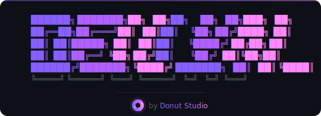

<div align="center">

<br />

<picture>
  
</picture>

### Context Engineering & Harness Engineering Toolkit for Claude Code

**Structured prompts, agent orchestration, and automated pipelines — debugging, code review, UI design, product specs, and more.**

[](https://www.npmjs.com/package/devlyn-cli)
[](https://www.npmjs.com/package/devlyn-cli)
[](https://opensource.org/licenses/MIT)
[](https://docs.anthropic.com/en/docs/claude-code)

If devlyn-cli saved you time, [give it a star](https://github.com/fysoul17/devlyn-cli) — it helps others find it too.

</div>

---

## Install

```bash
npx devlyn-cli
```

That's it. The interactive installer handles everything. Claude Code config is installed by default; optional AI CLI instructions can be selected during install. Choose **Codex CLI (OpenAI)** to install `AGENTS.md`. Run it again anytime to update.

---

## How It Works — Two Skills, Full Cycle

devlyn-cli turns Claude Code into a hands-free development pipeline. The product surface is two skills:

```
ideate (optional)  →  resolve  →  ship
```

### Step 1 (optional) — Plan with `/devlyn:ideate`

Turn a raw idea into a verifiable spec — single-feature, multi-feature, or "normalize this external doc".

```
/devlyn:ideate "I want to build a habit tracking app with AI nudges"
```

Default mode produces a `docs/specs/<id>-<slug>/spec.md` plus `spec.expected.json` (mechanical verification block) that `/devlyn:resolve --spec` consumes directly. Modes:

| Mode | When to use |
|---|---|
| `default` | One feature, AI drives focused Q&A |
| `--quick` | One-line goal → assume-and-confirm spec, single-turn (autonomous-pipeline-safe) |
| `--from-spec <path>` | You already wrote a spec; ideate normalizes + lints it |
| `--project` | Multi-feature project: emits `plan.md` index + N child specs |

Skip ideate entirely if you have a spec or just want to describe the work — `/devlyn:resolve` accepts free-form goals too.

### Step 2 — Resolve with `/devlyn:resolve`

Hands-free pipeline for any coding task — bug fix, feature, refactor, debug, modify, PR review. Pass a spec, a free-form goal, or a diff to verify.

```
/devlyn:resolve "fix the login bug"                                # free-form
/devlyn:resolve --spec docs/specs/2026-05-04-auth/spec.md          # spec mode
/devlyn:resolve --verify-only <diff-or-PR-ref> --spec <path>       # verify-only
```

Internal phases run sequentially with file-based handoff via `.devlyn/pipeline.state.json`:

```
PLAN  →  IMPLEMENT  →  BUILD_GATE  →  CLEANUP  →  VERIFY (fresh subagent, findings-only)
```

- **PLAN** is the heaviest phase by design — formalizes invariants from the spec/goal and the file list to touch.
- **BUILD_GATE** runs your project's real compilers, typecheckers, linters, and `python3 .claude/skills/_shared/spec-verify-check.py` (verification commands literal-match). Auto-detects Next.js, Rust, Go, Solidity, Expo, Swift, and Dockerfiles. Browser flows route through Chrome MCP → Playwright → curl tier.
- **VERIFY** runs in a fresh subagent context with no code-mutation tools — findings only, structurally independent.
- Git checkpoints at every phase for safe rollback. Fix-loop budget shared across BUILD_GATE and VERIFY (`--max-rounds N`, default 4).

Common flags: `--engine claude|codex|auto` (default `claude`), `--bypass build-gate,cleanup`, `--pair-verify` (force pair-mode JUDGE in VERIFY), `--perf` (per-phase timing).

### Engine selection — Claude solo by default

`--engine claude` (default) is the canonical surface. Every phase routes to Claude.

`--engine codex` routes IMPLEMENT to Codex; `--engine auto` opts into the experimental dual-engine routing where applicable. Both are research-only at HEAD: iter-0020 closed Codex BUILD/IMPLEMENT below the quality floor on the 9-fixture suite (L2 vs L1 = −3.6, 3/8 gated fixtures cleared the +5 margin floor — release-readiness FAIL); iter-0033g + iter-0034 closed PLAN-pair as research-only with explicit unblock conditions (container/sandbox infra OR production telemetry capturing positive evidence of subagent introspection). Install the Codex CLI (https://platform.openai.com/docs/codex) and pass the flag explicitly to opt in:

```
/devlyn:resolve "fix the auth bug" --engine auto   # experimental, research-only
```

If Codex is absent when `--engine auto` or `--engine codex` is requested, the harness silently downgrades to `--engine claude` and emits a banner in the final report.

<details>
<summary><strong>What's new in 1.14.0</strong> — CPO lens + handoff enforcement</summary>

`/devlyn:ideate` now thinks like a world-class Product Owner, and `/devlyn:auto-resolve` finally honors the spec contract the ideate skill was already designed to produce. Validated with 19 parallel eval subagents, 1.2M tokens of evidence — Customer Frame propagation went from 0/20 to 20/20 across seven test scenarios.

- **Jobs-to-be-Done forcing in FRAME** — ideate's opening FRAME phase now requires a one-sentence JTBD statement ("When [situation], [user] wants [motivation] so they can [outcome]") before anything else. A bare problem statement is a state description, not a job — downstream specs built without this frame describe system behavior instead of customer progress.
- **Customer Frame field on every item spec** — item-spec template gains a `## Customer Frame` section between Context and Objective that carries the per-item JTBD sentence all the way through to auto-resolve's build agent. The build agent uses this line to resolve ambiguity in Requirements rather than inventing interpretations.
- **PHASE 0.5 SPEC PREFLIGHT on auto-resolve** — when the task names a `docs/roadmap/phase-N/...md` spec, auto-resolve now reads it BEFORE BUILD, verifies internal dependencies are `status: done`, and writes `.devlyn/SPEC-CONTEXT.md` so downstream phases stop re-deriving what the spec already owns. Un-done deps halt the pipeline with `BLOCKED` rather than shipping out-of-sequence code.
- **Done-criteria verbatim copy** — when PHASE 0.5 found a spec, BUILD's Phase B copies the spec's `Requirements`, `Out of Scope`, and `Verification` sections verbatim into `.devlyn/done-criteria.md`. No silent re-derivation; the ideate CHALLENGE rubric's validation is preserved through the handoff.
- **Spec-bounded exploration** — BUILD's Phase A uses the spec's `Architecture Notes` + `Dependencies` as the exploration boundary instead of re-classifying the task type open-endedly.
- **Complexity-gated team ceremony** — `complexity: low` specs with no security/auth/API/data risk keywords skip TeamCreate entirely. Medium/high complexity or risk-flagged specs still assemble the team as before.
- **Evidence discipline in ideate EXPLORE** — research phase now labels unsourced market/tech claims `[UNVERIFIED]` inline rather than presenting recall as fact. The CHALLENGE rubric's NO GUESSWORK axis fires on unlabeled authoritative claims.
- **Mode tie-break rule** — when a request matches two ideate modes (Quick Add vs Expand, Research-first vs Deep-dive), the narrowest mode wins. Deterministic selection replaces intuitive match.
- **Bloat removal** — three redundant motivational blocks deleted from ideate SKILL.md (`<why_this_matters>` rationale, duplicate CHALLENGE preamble, external engine-routing pointer). SKILL.md shrank from 529 to 519 lines despite the new features.

</details>

<details>
<summary><strong>What's new in 1.13.0</strong> — Opus 4.7 pipeline pass</summary>

Core pipeline skills (`ideate`, `auto-resolve`, `preflight`) rewritten against Anthropic's Opus 4.7 prompting guidance, validated by multi-round comprehension and quality-grading subagents.

- **4.7 prompt patterns** — `<investigate_before_answering>` on evaluator and challenge, `<coverage_over_filtering>` with per-finding confidence, 3 few-shot examples in the Challenge phase, `<orchestrator_context>` (auto-compaction + xhigh effort), `<use_parallel_tool_calls>` in ideate EXPLORE and preflight Phase 0.
- **`--with-codex` consolidated into `--engine auto`** — auto covers BUILD/FIX + team roles + ideate CHALLENGE critic. Legacy flag still accepted with a graceful handoff. *(Note: post iter-0020 close-out, `--engine auto` is experimental research-only; default is `--engine claude`.)*
- **Bug fixes** — PHASE 1.5 BLOCKED browser failures re-route correctly via PHASE 2.5; PHASE 1.4-fix and PHASE 2.5 share one global round counter; preflight PHASE 1 numbering fixed; build-gate-exhausted now produces a graceful final report.
- **CLAUDE.md refresh** (shipped to `npx` installers) — Quick Start pointing to ideate → auto-resolve → preflight, Context Window Management updated for Opus 4.7 auto-compaction, terminology refresh (TodoWrite → task tools, Task agents → Agent subagents).

</details>

---

## Optional Power-User Skills

Two creative skills have moved to `optional-skills/` — install them via the interactive installer when you need them.

| Command | Use When |
|---|---|
| `/devlyn:design-system` | Extract exact design tokens (colors, type scale, spacing) from a chosen UI style |
| `/devlyn:team-design-ui` | Multi-perspective design team generates 5 distinct UI style explorations |

> Earlier versions of devlyn-cli shipped 16+ skills (auto-resolve / preflight / evaluate / review / team-review / clean / update-docs / browser-validate / product-spec / feature-spec / recommend-features / discover-product / design-ui / implement-ui). These were consolidated into `/devlyn:resolve` (which folds verification, review, and cleanup into its phases) plus `/devlyn:ideate` (which absorbs the planning surfaces) in the iter-0034 Phase 4 cutover (2026-05-04). Upgrades automatically remove the legacy skill directories from `~/.claude/skills/`.

---

## Auto-Activated Skills

These activate automatically — no commands needed. They shape how Claude thinks during relevant tasks.

| Skill | Activates During |
|---|---|
| `root-cause-analysis` | Debugging — enforces 5 Whys, evidence standards |
| `code-review-standards` | Reviews — severity framework, approval criteria |
| `ui-implementation-standards` | UI work — design fidelity, accessibility, responsiveness |
| `code-health-standards` | Maintenance — dead code prevention, complexity thresholds |

---

## Optional Add-ons

Selected during install. Run `npx devlyn-cli` again to add more.

<details>
<summary><strong>Skills</strong> — copied to <code>.claude/skills/</code></summary>

| Skill | Description |
|---|---|
| `asset-creator` | AI pixel art game asset pipeline — generate, chroma-key, catalog |
| `cloudflare-nextjs-setup` | Cloudflare Workers + Next.js with OpenNext |
| `generate-skill` | Create Claude Code skills following Anthropic best practices |
| `prompt-engineering` | Claude 4 prompt optimization |
| `better-auth-setup` | Better Auth + Hono + Drizzle + PostgreSQL |
| `pyx-scan` | Check if an AI agent skill is safe before installing |
| `dokkit` | Document template filling for DOCX/HWPX |
| `devlyn:pencil-pull` | Pull Pencil designs into code |
| `devlyn:pencil-push` | Push codebase UI to Pencil canvas |
| `devlyn:reap` | Safely reap orphaned MCP / codex / Superset child processes |
| `devlyn:design-system` | Extract design tokens from a chosen UI style for exact reproduction |
| `devlyn:team-design-ui` | 5 distinct UI style explorations from a full design team |

</details>

<details>
<summary><strong>Community Packs</strong> — installed via <a href="https://github.com/anthropics/skills">skills CLI</a></summary>

| Pack | Description |
|---|---|
| `vercel-labs/agent-skills` | React, Next.js, React Native best practices |
| `supabase/agent-skills` | Supabase integration patterns |
| `coreyhaines31/marketingskills` | Marketing automation and content skills |
| `anthropics/skills` | Official Anthropic skill-creator with eval framework |
| `Leonxlnx/taste-skill` | Premium frontend design skills |

</details>

<details>
<summary><strong>MCP Servers</strong> — installed via <code>claude mcp add</code></summary>

| Server | Description |
|---|---|
| `playwright` | Playwright MCP — powers `/devlyn:resolve` BUILD_GATE browser tier (Chrome MCP → Playwright → curl fallback) |

> `--engine auto/codex` uses the local `codex` CLI binary, not MCP. Install from https://platform.openai.com/docs/codex; the harness silently downgrades to `--engine claude` if the CLI is missing.

</details>

> **Want to add a pack?** Open a PR adding it to the `OPTIONAL_ADDONS` array in [`bin/devlyn.js`](bin/devlyn.js).

---

## Requirements

- **Node.js 18+**
- **[Claude Code](https://docs.anthropic.com/en/docs/claude-code)** installed and configured

## Contributing

- **Add a skill** — directory in `config/skills/` with `SKILL.md`
- **Add optional skill** — add to `optional-skills/` and `OPTIONAL_ADDONS` in [`bin/devlyn.js`](bin/devlyn.js)
- **Suggest a pack** — PR to the pack list

## Star History

[](https://star-history.com/#fysoul17/devlyn-cli&Date)

## License

[MIT](LICENSE) — Nocodecat @ Donut Studio
