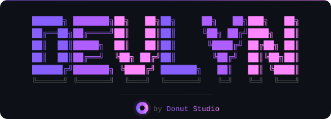

<div align="center">

<br />

<picture>
  
</picture>

### Context, Harness & Loop Engineering Toolkit for AI Coding Agents

**Structured prompts, agent orchestration, and automated pipelines — debugging, code review, UI design, product specs, and more.**

[](https://www.npmjs.com/package/devlyn-cli)
[](https://www.npmjs.com/package/devlyn-cli)
[](https://opensource.org/licenses/MIT)
[](https://docs.anthropic.com/en/docs/claude-code)

If devlyn-cli saved you time, [give it a star](https://github.com/fysoul17/devlyn-cli) — it helps others find it too.

</div>

---

## Install

```bash
npx devlyn-cli
```

That's it. The installer opens with a single **agent selector** — pick any combination of **Claude Code**, **Codex CLI**, **oh-my-pi (omp)**, **Pi**, or **Grok Build CLI**, and devlyn installs into every one you choose in a single pass. Claude Code and any agent already present on your machine are pre-checked, so the common case is just Enter. Skill-capable agents receive the `devlyn:resolve`, `devlyn:ideate`, and `devlyn:design-ui` skills — plus the `devlyn:engines` and `devlyn:queue` utilities — in the directory each one loads from: Codex → `~/.codex/skills/`, Grok → `~/.grok/skills/`, while **omp and Pi share `~/.agents/skills/`** — the cross-agent standard both read — so the bundle is written there once, not duplicated per agent. In Codex / omp / Pi, invoke them as skills (`$devlyn:resolve`, `$devlyn:ideate`, `$devlyn:design-ui`); in Claude Code and Grok Build CLI they're slash commands (`/devlyn:resolve`). Rerunning refreshes skills for selected agents, preserves existing AGENTS.md without legacy managed markers (legacy appended blocks are still cleaned up), and replaces CLAUDE.md when Claude Code is selected. Use the bundled AGENTS.md template path printed by the installer to compare and merge relevant shared runtime instructions into your preserved AGENTS.md, retaining your content and keeping engine-specific instructions distinct. (`npx devlyn-cli -y` installs the Claude core non-interactively; `npx devlyn-cli agents <cli>` adds one agent later.)

---

## How It Works — Two Skills, Full Cycle

devlyn-cli turns your AI coding agent into a hands-free development pipeline. The pipeline surface is two skills, with `/devlyn:design-ui` installed as the required creative UI surface:

```
ideate (optional)  →  resolve  →  ship
```

Non-Claude agents (Codex / omp / Pi / Grok): when one of these is selected, the workflows install as that agent's skills. In Codex / omp / Pi, use `$devlyn:ideate`, `$devlyn:resolve`, or `$devlyn:design-ui`; in Grok, use `/devlyn:ideate`, `/devlyn:resolve`, or `/devlyn:design-ui`, the same slash-command form as Claude Code.

### Step 1 (optional) — Plan with `/devlyn:ideate`

Turn a raw idea into a verifiable spec — single-feature, multi-feature, or "normalize this external doc".

```
/devlyn:ideate "I want to build a habit tracking app with AI nudges"
```

Default mode produces a `docs/specs/<id>-<slug>/spec.md` plus `spec.expected.json` (mechanical verification block) that `/devlyn:resolve --spec` consumes directly. Modes:

| Mode | When to use |
|---|---|
| `default` | One feature, AI drives focused Q&A |
| `--quick` | One-line goal → assume-and-confirm spec, single-turn (autonomous-pipeline-safe) |
| `--from-spec <path>` | You already wrote a spec; ideate normalizes + lints it |
| `--project` | Multi-feature project: emits `plan.md` index + N child specs |

Skip ideate entirely if you have a spec or just want to describe the work — `/devlyn:resolve` accepts free-form goals too.

### Step 2 — Resolve with `/devlyn:resolve`

Before writes, inspect requested files and relevant callers/tests. Clear, local, reversible, low-risk conversational edits with a decisive acceptance check run directly, honoring scope, constraints and executor pins; finish required checks and diff review, then report evidence. Material ambiguity, subsystem/design work, security/auth/payment/persistence/concurrency/public-API-contract changes or no decisive check use full `/devlyn:resolve`. Explicit resolve (including small tasks), formal specs and queue drains keep the full workflow below. Pass a spec, a free-form goal, or a diff to verify.

```
/devlyn:resolve "fix the login bug"                                # free-form
/devlyn:resolve --spec docs/specs/2026-05-04-auth/spec.md          # spec mode
/devlyn:resolve --verify-only <diff-or-PR-ref> --spec <path>       # verify-only
```

Internal phases run sequentially with file-based handoff via `.devlyn/pipeline.state.json`:

```
PLAN  →  IMPLEMENT  →  BUILD_GATE  →  CLEANUP  →  VERIFY (fresh subagent, findings-only)
```

- **PLAN** is the heaviest phase by design — formalizes invariants from the spec/goal and the file list to touch.
- **BUILD_GATE** runs your project's real compilers, typecheckers, linters, and `python3 .claude/skills/_shared/spec-verify-check.py` (verification commands literal-match). Auto-detects Next.js, Rust, Go, Solidity, Expo, Swift, and Dockerfiles. Browser flows route through Chrome MCP → Playwright → curl tier.
- **VERIFY** runs in a fresh subagent context with no code-mutation tools — findings only, structurally independent.
- Git checkpoints at every phase for safe rollback. Fix-loop budget shared across BUILD_GATE and VERIFY (`--max-rounds N`, default 4).

Common flags: `--engine claude|codex|omp` (default: the orchestrator-supported default), `--role-config <path>` (one-run worker/judge profiles, see below), `--bypass build-gate,cleanup`, `--pair-verify` (force pair-mode JUDGE in VERIFY), `--no-pair` (intentional solo VERIFY), `--risk-probes` / `--no-risk-probes`, `--perf` (per-phase timing).
`--pair-verify` and `--no-pair` are mutually exclusive; using both stops with `BLOCKED:invalid-flags`.

Free-form goals that ask for benchmark evidence, pair-evidence, risk-probe
measurement, `solo<pair` proof, or solo-headroom work must include an
actionable `solo-headroom hypothesis` naming the visible behavior `solo_claude`
is expected to miss plus a backticked observable command; the backticked line
itself must contain `miss` and be framed as the command/observable that exposes it. Without that,
`/devlyn:resolve` stops with `BLOCKED:solo-headroom-hypothesis-required` and
points you to `/devlyn:ideate` instead of inventing a weak hypothesis.
Free-form goals that add or run a new unmeasured benchmark, shadow fixture,
golden fixture, risk-probe, or pair-evidence candidate must also include
`solo ceiling avoidance`, mention `solo_claude`, and name the concrete
difference from rejected or solo-saturated controls such as `S2`-`S6`; without
that, `/devlyn:resolve` stops with `BLOCKED:solo-ceiling-avoidance-required`.

### Queue multiple intents for unattended drain — `/devlyn:queue`

Stack tasks to run back-to-back without supervision. `/devlyn:queue add "<intent>"` appends to `docs/specs/queue.md` (an ordered checklist); `/devlyn:queue drain` runs each item serially — spec it, run the resolve outer loop, mark `[x]` done or `[F]` blocked with a reason, then move on. A blocked item never halts the queue, and unattended runs only take scope-narrowing, reversible defaults — anything user-visible or ambiguous is marked `[F] needs-review` for you to adjudicate afterward. `/devlyn:queue` with no args shows status.

### Engine roles — auto-detected, pinnable with `/devlyn:engines`

devlyn separates three engine roles:

- **Orchestrator** — the CLI you opened (Claude Code, Codex, or omp) that drives the conversation and loop. The contract is symmetric (`CLAUDE.md` ↔ `AGENTS.md`), so the same phase-gated pipeline runs whichever you launch; the file artifacts (spec, queue, state) carry over if you switch.
- **Executor** (legacy) — the worker for IMPLEMENT / CLEANUP and their repair rounds, and the primary VERIFY judge, unless either is separately profiled (below). Defaults to the orchestrator-supported default. PLAN is orchestrator-fixed and never inherits `--engine` or an executor pin. An absent primary profile follows the legacy executor, not an opt-in worker profile.
- **Pair judge** — the first available *other* engine, default for VERIFY and conditional for risk probes.

`--engine <name>` sets the legacy executor for one run as an engine-only entry (it clears any lower-precedence profile's model/effort). BUILD_GATE and risk-probe derivation keep their existing routes; PLAN always runs on the orchestrator's native worker. VERIFY/JUDGE runs pair mode by default when the OTHER engine is available.

Pin roles durably with `/devlyn:engines` (no args shows the role table + detected engines; `executor <name>` / `pair <name>,...` / `role <worker|primary_judge|pair_judge> <JSON object>` / `role <name> clear` manage the pins, stored machine-local in `.devlyn/engines.json`; `clear` removes all legacy and role pins, preserves unrelated keys, and deletes an empty file). Pins fail closed: an unavailable pinned engine stops with `BLOCKED:<engine>-unavailable`, and a name with no `_shared/adapters/<name>.md` adapter stops with `BLOCKED:invalid-engine-config`. New engines plug in by shipping an adapter file — no skill changes.

#### Explicit worker and judge profiles

`.devlyn/engines.json` may add a `roles` object with `worker`, `primary_judge`, and `pair_judge` entries. Each entry requires `engine` and accepts an optional exact `model` ID and `effort`; unknown fields, aliases (`default`, `auto`, `opus`, `sonnet`, `fable`, `codex` as a model), null/empty values, and duplicate keys stop with `BLOCKED:invalid-engine-config`. Only the project's own `.devlyn/engines.json` is read — no parent or global lookup. Example (an example, not a default or ranking):

```json
{
  "executor": "codex",
  "pair_judge_priority": ["claude"],
  "roles": {
    "worker": {"engine": "codex", "model": "gpt-6-astra", "effort": "xhigh"},
    "primary_judge": {"engine": "codex", "model": "gpt-6-astra", "effort": "high"},
    "pair_judge": {"engine": "claude", "model": "claude-fable-5-1", "effort": "medium"}
  }
}
```

`--role-config <path>` supplies the same `{"roles": {...}}` object for one run only, with no other top-level keys; the flag may appear once.

- **Precedence** — an entry replaces the lower one as a whole; model/effort never merge across engines. Worker and primary judge: run `--role-config` entry > `--engine` (engine-only) > project role entry > legacy executor/default. Pair judge: run entry > project entry > `pair_judge_priority` / the OTHER-engine complement. A missing `model`/`effort` keeps that route's current default and is shown as inherited/unresolved.
- **Boundaries** — `worker` covers IMPLEMENT / CLEANUP and their repair rounds; `primary_judge` and `pair_judge` cover VERIFY only. PLAN stays orchestrator-fixed, BUILD_GATE keeps its existing route, and risk-probe derivation stays outside these controls. OTHER must differ from the primary by engine: an explicit same-engine pair is `BLOCKED:invalid-engine-config`. `--no-pair` is unchanged — explicit solo VERIFY; an unused pair entry is neither dispatched nor availability-checked.
- **Initial explicit routes** — Codex worker/primary/pair accept exact `model` + `effort` (dispatched as `-m` / `-c model_reasoning_effort=`, validated against the installed Codex CLI's native model metadata for its version). Claude primary/pair judges pass an exact `model` as `--model` and validate native result identity; model-only selection needs no source update for a new ID. Explicit `effort` separately requires the adapter's version/model support declaration. The Claude worker stays the native `Agent` route and is engine-only: explicit `model`/`effort` on a Claude worker is `BLOCKED:unsupported-role-option` — a supported-route boundary, not a claim that Claude cannot implement. Other adapters (omp, grok) are engine-only for their eligible roles.
- **Errors** — `BLOCKED:unsupported-role-option` names the role, engine and field with guidance; there is no clamp, fallback, substituted model, or weaker retry. An explicitly selected engine (flag, pin, or profile) that is unavailable stops with `BLOCKED:<engine>-unavailable`. A native warning that a requested option was ignored is a failed promise even at exit 0.
- **Requested vs observed** — `/devlyn:engines` status prints each role's requested engine/model/effort, source and dispatch channel before dispatch; it describes a request and does not prove a native invocation happened. Effective model is reported only with native evidence; a Codex worker receipt binds requested dispatch and leaves effective model unknown. A reported worker model reroute blocks completion even at exit 0. SURFACE_CLOSE inherits native Claude model settings and records the model from its required JSON result. Effective effort stays unknown unless native evidence establishes it — invocation arguments prove dispatch, not provider-internal reasoning.

`--engine codex` routes IMPLEMENT / CLEANUP to Codex as a supported engine-only route (exact model/effort via the profiles above). Historical record: iter-0020 closed Codex BUILD/IMPLEMENT below the quality floor on the 9-fixture suite (L2 vs L1 = −3.6, 3/8 gated fixtures cleared the +5 margin floor — release-readiness FAIL). Separately, PLAN-pair remains research-only: iter-0033g + iter-0034 closed it with explicit unblock conditions (container/sandbox infra OR production telemetry capturing positive evidence of subagent introspection). Install the Codex CLI (https://platform.openai.com/docs/codex) and pass the flag explicitly to opt in:

```
/devlyn:resolve "fix the auth bug" --engine codex
```

If an engine is absent when explicitly selected by flag, pin, or role profile, or OTHER engine is absent under `--pair-verify`, the harness stops with `BLOCKED:<engine>-unavailable` and prints setup guidance. Automatic VERIFY absence is a reported solo route. Use `--no-pair` only when intentionally accepting solo VERIFY; use `--no-risk-probes` only when intentionally disabling automatic high-risk probes.

### Benchmark score runs

Use the benchmark CLI when a change claims `solo_claude < pair`. The score-focused runners print the run id, startup gate lines, blind-judge score tables, fixture pair margins, average pair margin, wall-time ratio, and failure reasons:

```bash
npx devlyn-cli benchmark headroom --min-fixtures 3 F16-cli-quote-tax-rules F23-cli-fulfillment-wave F25-cli-cart-promotion-rules
npx devlyn-cli benchmark recent
npx devlyn-cli benchmark recent --out-md /tmp/devlyn-recent-benchmark.md
npx devlyn-cli benchmark frontier --out-md /tmp/devlyn-pair-frontier.md
npx devlyn-cli benchmark audit --out-dir /tmp/devlyn-benchmark-audit
npx devlyn-cli benchmark audit-headroom --out-json /tmp/devlyn-headroom-audit.json
npx devlyn-cli benchmark pair --min-fixtures 3 --max-pair-solo-wall-ratio 3 F16-cli-quote-tax-rules F23-cli-fulfillment-wave F25-cli-cart-promotion-rules
```

`benchmark recent` prints a compact, wrap-safe snapshot of the current local
pair evidence: status counts, pair-lift aggregates, and one card per passing
pair-evidence fixture. It intentionally avoids wide Markdown tables, so the
same output stays readable in narrow terminals, PR comments, and release notes.
`benchmark frontier` also prints a stdout score summary for existing complete pair
evidence rows, including pair arm, trigger reasons, average/minimum pair margin,
and wall ratio, plus row-level verdicts even when `--out-json` or `--out-md`
writes an artifact. Markdown frontier artifacts include a `Triggers` column.
Full-pipeline pair gate artifacts record `require_hypothesis_trigger` in JSON
and include a Markdown `Hypothesis trigger` column, so strict regenerated
evidence shows whether each row carried `spec.solo_headroom_hypothesis`.
`benchmark audit` is the provider-free release/handoff guard: it writes
`audit.json` with the frontier summary, artifact map, and compact trigger-backed verdict-bearing `pair_evidence_rows`
(each row carries `pair_trigger_eligible: true`, non-empty `pair_trigger_reasons`, `pair_trigger_has_canonical_reason: true`, and `pair_trigger_has_hypothesis_reason`; the audit fails rows missing trigger reasons or missing actionable solo-headroom hypotheses in fixture `spec.md` whose observable command matches `expected.json`), runs the frontier with
`--fail-on-unmeasured`, requires at least four fixtures with passing pair evidence,
revalidates frontier `verdict: PASS`, zero unmeasured candidates, and revalidates `pair_mode: true`,
the default 5-point pair margin, and 3x pair/solo wall ratio, then
audits failed headroom results. The audit stdout also prints
`headroom_rejections=...`, `pair_evidence_quality=...`,
`pair_trigger_reasons=...`, `pair_evidence_hypotheses=...`, and
`pair_evidence_hypothesis_triggers=...` handoff rows, plus
`pair_trigger_historical_aliases=...` when archived evidence includes legacy
trigger aliases and `pair_evidence_hypothesis_trigger_gaps=...` when documented
hypotheses have not yet propagated into trigger reasons, with the rejected-fixture
coverage counts plus actual minimum pair margin, maximum pair/solo wall ratio,
and canonical trigger reason coverage plus row-match status.
The compact evidence row count must match the frontier evidence count,
`checks.frontier_stdout` records summary, aggregate, final-verdict, expected, printed score-row, trigger-visible row, and hypothesis-trigger-visible row counts,
`checks.headroom_rejections` records child verdict plus unrecorded/unsupported counts,
`checks.pair_evidence_quality` records the same quality thresholds from the compact rows,
`checks.pair_trigger_reasons` records canonical/historical-alias/exposed/total trigger-reason row counts, fixture-level historical alias details, summary count, and row-match status,
`checks.pair_evidence_hypotheses` records documented/total pair-evidence hypothesis row counts,
and `checks.pair_evidence_hypothesis_triggers` records whether documented hypotheses also appear as `spec.solo_headroom_hypothesis` trigger reasons plus fixture-level gap details
so incomplete or low-quality local score artifacts cannot inflate the claim.
Add `--require-hypothesis-trigger` to turn those hypothesis-trigger gaps from
archived-evidence WARN rows into release-blocking FAIL rows for newly
regenerated pair evidence.

```bash
npx devlyn-cli benchmark audit --require-hypothesis-trigger --out-dir /tmp/devlyn-benchmark-audit-strict
```

Historical trigger aliases are only reported for archived artifact review; new
current pair-evidence gates fail historical-only or unknown trigger reasons and
require at least one canonical `pair_trigger.reasons` entry.
`benchmark audit-headroom` fails if an active failed headroom fixture is missing
from both rejected registry and passing pair evidence.
Headroom runs use the current claim gate: `bare <= 60`, `solo_claude <= 80`,
and the default 5-point `bare`/`solo_claude` headroom margins before spending a pair arm.
Add `--dry-run` to either score runner to validate args, fixture ids, minimum
fixture count, and the replay command without running arms or judges. Dry-runs
and lint prove wiring only; real score claims must cite the run id and fixture
ids.

### Migration from earlier versions

<!-- legacy-surface-map:begin — retired command names below are documented as OLD, not current; lint Check 10c skips this block -->
Earlier versions of devlyn-cli shipped 16+ slash commands. The iter-0034 Phase 4 cutover (2026-05-04) and the 2026-05-14 follow-up consolidated them down to the three current commands. Upgrades automatically purge the legacy skill directories from `~/.claude/skills/`.

| Old command | Now use |
|---|---|
| `/devlyn:auto-resolve`, `/devlyn:preflight`, `/devlyn:evaluate`, `/devlyn:review`, `/devlyn:team-resolve`, `/devlyn:team-review`, `/devlyn:clean`, `/devlyn:update-docs`, `/devlyn:browser-validate`, `/devlyn:implement-ui` | `/devlyn:resolve` (folds them into PLAN → IMPLEMENT → BUILD_GATE → CLEANUP → VERIFY) |
| `/devlyn:product-spec`, `/devlyn:feature-spec`, `/devlyn:recommend-features`, `/devlyn:discover-product` | `/devlyn:ideate` |
| `/devlyn:team-design-ui` | `/devlyn:design-ui` (now always spawns the 5-specialist team — Creative Director, Product Designer, Visual Designer, Interaction Designer, Accessibility Designer) |
| `/devlyn:design-system` | Removed 2026-05-14 — no replacement |
<!-- legacy-surface-map:end -->

---

## Auto-Activated Skills

These activate automatically — no commands needed. They shape how Claude thinks during relevant tasks.

| Skill | Activates During |
|---|---|
| `root-cause-analysis` | Debugging — enforces 5 Whys, evidence standards |
| `code-review-standards` | Reviews — severity framework, approval criteria |
| `ui-implementation-standards` | UI work — design fidelity, accessibility, responsiveness |
| `code-health-standards` | Maintenance — dead code prevention, complexity thresholds |

---

## Optional Add-ons

Selected during install. Run `npx devlyn-cli` again to add more.

<details>
<summary><strong>Skills</strong> — copied to <code>.claude/skills/</code></summary>

| Skill | Description |
|---|---|
| `asset-creator` | AI pixel art game asset pipeline — generate, chroma-key, catalog |
| `cloudflare-nextjs-setup` | Cloudflare Workers + Next.js with OpenNext |
| `generate-skill` | Create Claude Code skills following Anthropic best practices |
| `prompt-engineering` | Claude prompt optimization |
| `better-auth-setup` | Better Auth + Hono + Drizzle + PostgreSQL |
| `pyx-scan` | Check if an AI agent skill is safe before installing |
| `dokkit` | Document template filling for DOCX/HWPX |
| `devlyn:pencil-pull` | Pull Pencil designs into code |
| `devlyn:pencil-push` | Push codebase UI to Pencil canvas |
| `devlyn:reap` | Safely reap orphaned MCP / codex / Superset child processes |

</details>

<details>
<summary><strong>Community Packs</strong> — installed via <a href="https://github.com/anthropics/skills">skills CLI</a></summary>

| Pack | Description |
|---|---|
| `vercel-labs/agent-skills` | React, Next.js, React Native best practices |
| `supabase/agent-skills` | Supabase integration patterns |
| `coreyhaines31/marketingskills` | Marketing automation and content skills |
| `anthropics/skills` | Official Anthropic skill-creator with eval framework |
| `Leonxlnx/taste-skill` | Premium frontend design skills |

</details>

<details>
<summary><strong>MCP Servers</strong> — installed via <code>claude mcp add</code></summary>

| Server | Description |
|---|---|
| `playwright` | Playwright MCP — powers `/devlyn:resolve` BUILD_GATE browser tier (Chrome MCP → Playwright → curl fallback) |

> `--engine codex` and default-when-available VERIFY pair mode use the local `codex` CLI binary, not MCP. Install from https://platform.openai.com/docs/codex, run the current Codex auth/login flow, verify `codex --version`, then rerun.

</details>

> **Want to add a pack?** Open a PR adding it to the `OPTIONAL_ADDONS` array in [`bin/devlyn.js`](bin/devlyn.js).

---

## Requirements

- **Node.js 18+**
- **[Claude Code](https://docs.anthropic.com/en/docs/claude-code)** installed and configured

## Contributing

- **Add a skill** — directory in `config/skills/` with `SKILL.md`
- **Add optional skill** — add to `optional-skills/` and `OPTIONAL_ADDONS` in [`bin/devlyn.js`](bin/devlyn.js)
- **Suggest a pack** — PR to the pack list

## Supercharge it — pair devlyn with persistent agent memory

devlyn-cli gives your agent a world-class **harness**. Give it a world-class **memory** and the loop compounds — decisions, corrections, and hard-won context survive across sessions instead of resetting every conversation.

> [!TIP]
> ### 🧠 [pyx-memory](https://memory.pyxmate.com) — world-class agentic memory (hybrid RAG) for coding agents
> Durable facts, corrections, and project state your agent recalls and reinforces — so every run starts smarter than the last. → **[memory.pyxmate.com](https://memory.pyxmate.com)**

- **Remembers across sessions** — decisions, gotchas, preferences, and project state, not just this conversation
- **Hybrid retrieval** — semantic *and* graph recall: find by meaning *and* by relationship
- **Learns the loop** — reinforces what works, records corrections when it doesn't

**Harness (devlyn) + Memory (pyx-memory) = agents that don't just execute — they improve.** Wire up **pyx-memory** as an MCP server and `/devlyn:resolve` recalls prior decisions before it plans and stores what it learns after it ships.

## Support & Attribution

devlyn-cli is built and maintained in the open. If it earns a place in your workflow, two small things keep it alive and help others find it:

- ⭐️ **Star the repo** — [give it a star](https://github.com/fysoul17/devlyn-cli) if it saved you time. It's the single biggest signal that keeps the project going.
- 🔗 **Leave a credit** — if devlyn-cli helped ship your project, a small attribution is genuinely appreciated (kindly requested, never required — the MIT license asks nothing of you here). Drop this badge in your README:

  ```md
  [](https://github.com/fysoul17/devlyn-cli)
  ```

  Renders as [](https://github.com/fysoul17/devlyn-cli)

Thank you for using devlyn — it genuinely means a lot. 🙏

## Star History

[](https://star-history.com/#fysoul17/devlyn-cli&Date)

## License

[MIT](LICENSE) — Nocodecat @ Donut Studio
