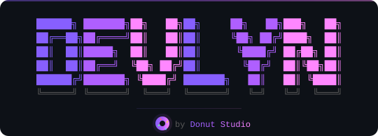

<div align="center">

<br />

<picture>
  
</picture>

### Context, Harness & Loop Engineering Toolkit for AI Coding Agents

**Engineering principles for every coding agent, and a loop designer that turns one intent into tasks agents drain without you.**

[](https://www.npmjs.com/package/devlyn-cli)
[](https://www.npmjs.com/package/devlyn-cli)
[](https://opensource.org/licenses/MIT)
[](https://docs.anthropic.com/en/docs/claude-code)

If devlyn-cli saved you time, [give it a star](https://github.com/fysoul17/devlyn-cli) — it helps others find it too.

</div>

---

## Install

```bash
npx devlyn-cli
```

That's it. The installer asks:

1. **What** — `AGENTS.md — Codex · omp · Pi · Grok` (checked) and `CLAUDE.md — Claude Code` (checked when this project already has a devlyn Claude install). Space toggles, Enter confirms.
2. **Where** — `This project` (default) or `Global — every project on this machine`.
3. **Optional skills & packs** — none checked; see [Optional Add-ons](#optional-add-ons) below. MCP servers are offered only with CLAUDE.md.

In a project, AGENTS.md readers load the skills from `.agents/skills/`; Claude Code loads only `.claude/skills/` and reads AGENTS.md when the project has no CLAUDE.md; a CLAUDE.md the installer creates imports an existing AGENTS.md (`@AGENTS.md`). Global installs skills only: `~/.agents/skills/` (omp, Pi, Grok) and `~/.codex/skills/` (Codex), plus `~/.claude/skills/` for Claude Code. Every target gets the `devlyn-ideate` skill and the `devlyn-engines` utility. In Codex / omp / Pi, invoke them as skills (`$devlyn-ideate`); in Claude Code and Grok they're slash commands (`/devlyn-ideate`). Rerunning refreshes skills and the managed instruction block while preserving project rules outside it. See [Migration from earlier versions](#migration-from-earlier-versions) for legacy migration and merge recovery.

Without prompts, `npx devlyn-cli -y` installs AGENTS.md + `.agents/skills/` plus every target this project already has; add `--claude` for Claude Code. With `--global` it installs for every project on this machine, plus `~/.claude/skills/` with `--claude` or when it already has a devlyn install.

---

## How It Works — Principles and Loops

The managed `CLAUDE.md` / `AGENTS.md` block carries the North Star, seven principles (no workaround, no overengineering, no guesswork, worldclass, best practice, optimized, production ready) and three discipline rules, plus short pointers to the skills. Agents do the work directly under it; for work that splits into tasks, ideate designs a loop and drains it:

```
intent  →  direct work under the installed principles, or an ideate loop  →  ship
```

Non-Claude agents (Codex / omp / Pi / Grok): the AGENTS.md choice installs the skills for them. In Codex / omp / Pi, use `$devlyn-ideate`; in Grok, use `/devlyn-ideate`, the same slash-command form as Claude Code. A drain from Pi or Grok needs [a pinned executor](#executor--devlyn-engines).

### Plan and drain loops — `/devlyn-ideate`

Give ideate an intent or a document. It writes a loop package — a meta-prompt plus self-contained task contracts with mechanical acceptance — and agents drain the tasks one by one without you.

| Command | What it does |
|---|---|
| `/devlyn-ideate plan <intent or document>` | Inspects the project, asks only what it must, and writes a validated package to `docs/specs/<loop-id>/`. Nothing is queued or run. |
| `/devlyn-ideate add <intent or package>` | Plans when needed, then queues the package's tasks in dependency order. It makes no commit on your branch: the package and its rows in `docs/specs/<loop-id>/queue.md` are held at `refs/devlyn/captures/<loop-id>` and your copies are removed. The first task's commit brings them into history, and the drain report's `Bring into` command brings the result into your branch. |
| `/devlyn-ideate status` | Pending, active, accepted and failed counts; the next runnable task; delivery and recovery blockers. |
| `/devlyn-ideate drain` | Runs the queue serially and hands-free. |

A bare intent is planned and, when your request authorizes the work, added and drained without another confirmation; no arguments shows status. Questions come only when the answer changes behavior, scope, data semantics, acceptance or delivery, each with a recommended answer; `--autonomous` plans without questions, recording ordinary low-consequence, reversible defaults within the request, including user-visible details; material ambiguity in intended outcomes, persistent data or state semantics, or public surface beyond the request stops planning with a concrete question. Each task runs in its own worktree with the executor pinned by `/devlyn-engines` (default: the CLI you opened; Pi and Grok need a pin) under your installed CLAUDE.md/AGENTS.md instructions. Tasks start from committed state, the branch you added the loop on or the remote base for `auto`/`pr`, so commit the installer's changes and whatever a plan depends on before adding a loop, and push them for `auto`/`pr`. It is marked `[x]` only when its declared checks pass on its committed source and its required reviews cover it: the checks run through the drain's runner (a wholly clean run the executor lists for that source is reused; the drain runs any other check itself), and review coverage is attested by records the executor submits; a failed task becomes `[F]` with its reason and blocks only its dependents. An interrupted drain resumes without repeating accepted work. `--local-only` (or `--no-push`) keeps delivery local: each accepted task stays on its `devlyn/<loop-id>/<task-id>` branch in a retained worktree, nothing is merged or pushed, and the drain report's `Bring into` command is `git merge --ff <latest accepted task branch>`.

### Delivery

Direct work edits your current checkout; run parallel sessions in separate worktrees (for example `claude -w`). Completed, verified direct requests with changes, and
every drained task, are delivered by project policy from their own linked worktrees. A commit request stays local and a PR request stops at the PR; otherwise accepted tasks default to
scoped commit → push → PR → merge when the repository allows it (otherwise the PR waits for a person). After the
PR merges, the worktree and branch its session released are cleaned; anything in use is
kept. Set `git config --local devlyn.completionMode pr` to stop at the PR; `task-complete.py complete --mode auto|pr`
overrides one task. Local-only/no-push instructions take precedence: accepted work stays on
its task branch in its retained worktree, and nothing is pushed or merged. Existing
branches cannot be adopted. Direct tasks use their actual checks and root
acceptance. Pending checks or unsupported merge policy retain resources and
report a receipt-based resume command separately from product verification.
See [task completion](config/skills/_shared/task-completion.md)
for allocation, acceptance, writer cessation and recovery.

### Executor — `/devlyn-engines`

The orchestrator is the CLI you opened (Claude Code, Codex, omp, Pi or Grok); the contract is symmetric (`CLAUDE.md` ↔ `AGENTS.md`), so the loop's file artifacts carry over if you switch. The executor does the implementation work, direct or drained: the engine pinned in machine-local `.devlyn/engines.json`, else the CLI you opened. Pi and Grok have no executor adapter, so a drain from them needs `devlyn-engines executor <claude|codex|omp>`.

`/devlyn-engines` with no arguments shows the executor and the engines detected on this machine; `executor <name>` pins one and `clear` removes the pin. A pin is a promise: an unavailable pinned engine stops dispatch with `BLOCKED:<engine>-unavailable`, and a name with no executor-eligible `_shared/adapters/<name>.md` stops with `BLOCKED:invalid-engine-config`. Adapters ship with devlyn-cli releases; a reinstall replaces `_shared`.

### Migration from earlier versions

Reinstall with the new version to refresh instructions and skills for the selected
targets. Claude uses `CLAUDE.md`; Codex, Grok, omp and Pi share `AGENTS.md`.
Devlyn updates its checksum-marked instruction block and preserves project-specific
rules outside it. Keep custom rules outside the block; they take precedence over
its defaults. Exact pre-update backups are saved in `.devlyn/instructions/`.
When recovery is needed, pre-existing symlinks or non-directory entries at `.devlyn/` or
`.devlyn/instructions/` stop installation without replacing the instruction file.

Older and mixed-version templates migrate automatically. Within recognizable
Devlyn sections, exact historical paragraphs and list items are replaced;
modified or unknown text and its headings are preserved outside the new block.
Edits inside an existing managed block are preserved outside it too. Plain custom
files and rules outside managed blocks retain their contents. Unknown old text
is kept conservatively, even when it may contain obsolete defaults.
Malformed or duplicate managed markers still stop with an exact `.backup`, new
defaults in `.incoming`, and a `.merge.md` guide; the original remains unchanged.
Release packaging refreshes the offline fingerprints from Git history using
`node scripts/update-instruction-templates.js`; installation needs no Git or network.
Use 3.1.3 or newer consistently: older installers still overwrite `CLAUDE.md`.

Upgrading to 4.1.0: `npx devlyn-cli -y` in a 4.x project keeps its Claude Code install
current and adds `AGENTS.md` + `.agents/skills/`. Earlier releases put the Codex, omp, Pi
and Grok skills in `~/.codex/skills`, `~/.agents/skills` and `~/.grok/skills`; a project
install no longer refreshes them and names each one it finds. Refresh them with `--global`
or delete them; delete `~/.grok/skills`, since Grok now reads `~/.agents/skills`.
`npx devlyn-cli agents` was removed.

<!-- legacy-surface-map:begin — retired command names below are documented as OLD, not current; lint Checks 5e and 10c skip this block -->
Upgrading past 4.1.0: `/devlyn-resolve` and the pipeline helpers only it used are retired;
no measured replacement ships in their place. Run the installer again where devlyn is
installed. It removes the `devlyn-resolve` folders (and pre-4.0.0 `devlyn:resolve` ones)
where it installs, removes the Stop hook it added to `.claude/settings.json` while keeping
your own hooks, and names the other settings it once added for the pipeline
(`CLAUDE_CODE_EXPERIMENTAL_AGENT_TEAMS` and its `.devlyn` and git permissions) without
deleting them. `/devlyn-engines` keeps only the executor pin: `pair_judge_priority` and
`roles` in `.devlyn/engines.json` stay as written, select nothing, and `clear` removes them.
`task-complete.py` refuses acceptance that points at an archived resolve run
(`kind: pipeline`) before changing anything, and prints the command that finishes the run
with the release that produced it: `npm pack devlyn-cli@4.1.0`, extract the tarball, and run
`python3 package/config/skills/_shared/task-complete.py complete --receipt <receipt>
--acceptance <acceptance>` with your delivery flags. A PR/merge completion there binds the
acceptance before publishing, and a receipt it binds resumes delivery with the current
helper; with `--local-only` it ends as LOCAL_ONLY without binding, as 4.1.0 always did. To
keep using resolve itself, stay on `devlyn-cli@4.1.0`.

Upgrading to 4.0.0: every devlyn skill is renamed to the Agent Skills standard
(`/devlyn:ideate` → `/devlyn-ideate`; the full list is in the table below). Run the
installer in each project that has devlyn (`npx devlyn-cli`, or `-y` with `--claude` and
`--global` as needed): each run removes the old folders
where it installs and keeps an optional skill you had under its new name. A 3.x installer run
afterwards brings the old `devlyn:*` folders back beside some new ones and drops opted-in
pencil skills; run the 4.x installer again to repair it, and re-add those pencil skills from
its menu. An agent setting that disables a
devlyn skill by its old name or path (for example Codex `[[skills.config]]` or omp
`disabledExtensions`) needs the new name. A project that committed the old `devlyn:*`
folders checks out on Windows once that re-sync is committed.

Earlier versions of devlyn-cli shipped 16+ slash commands. The iter-0034 Phase 4 cutover (2026-05-04) and the 2026-05-14 follow-up consolidated them, 4.0.0 renamed every devlyn skill to the Agent Skills naming standard (`devlyn-<name>`: lowercase, digits and hyphens, the same as its folder), and after 4.1.0 resolve and design-ui were retired and the queue moved into ideate. Upgrades automatically purge the legacy skill directories.

| Old command | Now use |
|---|---|
| `/devlyn:auto-resolve`, `/devlyn:preflight`, `/devlyn:evaluate`, `/devlyn:review`, `/devlyn:team-resolve`, `/devlyn:team-review`, `/devlyn:clean`, `/devlyn:update-docs`, `/devlyn:browser-validate`, `/devlyn:implement-ui` | Folded into resolve, now retired — work directly under the installed principles |
| `/devlyn:product-spec`, `/devlyn:feature-spec`, `/devlyn:recommend-features`, `/devlyn:discover-product` | `/devlyn-ideate` |
| `/devlyn:design-system` | Removed 2026-05-14 — no replacement |
| `/devlyn:ideate`, `/devlyn:engines`, `devlyn:pencil-pull`, `devlyn:pencil-push`, `devlyn:reap` (3.x and earlier) | `/devlyn-ideate`, `/devlyn-engines`, `devlyn-pencil-pull`, `devlyn-pencil-push`, `devlyn-reap` (4.0.0) |
| `/devlyn:resolve` (3.x and earlier), `/devlyn-resolve` (4.0.0–4.1.0) | Retired — work directly under the installed principles; `/devlyn-ideate` plans and drains multi-task work |
| `/devlyn:queue` (3.x and earlier), `/devlyn-queue` (4.0.0–4.1.0) | `/devlyn-ideate add`, `status` and `drain` |
| `/devlyn-ideate --quick`, `--from-spec`, `--project` (4.1.0 and earlier) | `/devlyn-ideate plan`; `--autonomous` replaces `--quick` |
| `/devlyn:team-design-ui`, `/devlyn:design-ui` (3.x and earlier), `/devlyn-design-ui` (4.0.0–4.1.0) | Retired — no replacement |
<!-- legacy-surface-map:end -->

---

## Optional Add-ons

Selected during install. Run `npx devlyn-cli` again to add more.

<details>
<summary><strong>Skills</strong> — copied into every skill root the install writes</summary>

| Skill | Description |
|---|---|
| `asset-creator` | AI pixel art game asset pipeline — generate, chroma-key, catalog |
| `cloudflare-nextjs-setup` | Cloudflare Workers + Next.js with OpenNext |
| `generate-skill` | Create Claude Code skills following Anthropic best practices |
| `prompt-engineering` | Claude prompt optimization |
| `better-auth-setup` | Better Auth + Hono + Drizzle + PostgreSQL |
| `polar-billing-setup` | Polar usage-based / metered billing — setup and silent $0-billing diagnosis |
| `pyx-scan` | Check if an AI agent skill is safe before installing |
| `dokkit` | Document template filling for DOCX/HWPX |
| `devlyn-pencil-pull` | Pull Pencil designs into code |
| `devlyn-pencil-push` | Push codebase UI to Pencil canvas |
| `devlyn-reap` | Safely reap orphaned MCP / codex / Superset child processes |
| `code-health-standards` | Maintainability standards — dead code, dependencies, complexity, naming |
| `code-review-standards` | Severity framework and approval criteria for reviews |
| `root-cause-analysis` | Evidence-first why-chain debugging |
| `ui-implementation-standards` | UI quality bar — design tokens, accessibility, state coverage, responsive layout |

</details>

<details>
<summary><strong>Community Packs</strong> — installed via <a href="https://github.com/anthropics/skills">skills CLI</a></summary>

| Pack | Description |
|---|---|
| `vercel-labs/agent-skills` | React, Next.js, React Native best practices |
| `supabase/agent-skills` | Supabase integration patterns |
| `coreyhaines31/marketingskills` | Marketing automation and content skills |
| `anthropics/skills` | Official Anthropic skill-creator with eval framework |
| `Leonxlnx/taste-skill` | Premium frontend design skills |

</details>

<details>
<summary><strong>MCP Servers</strong> — installed via <code>claude mcp add</code>, offered with the CLAUDE.md choice</summary>

| Server | Description |
|---|---|
| `playwright` | Playwright MCP for browser testing |

> A Codex executor uses the local `codex` CLI binary, not MCP. Install it from https://platform.openai.com/docs/codex, run the current Codex auth/login flow and verify `codex --version`.

</details>

> **Want to add a pack?** Open a PR adding it to the `OPTIONAL_ADDONS` array in [`bin/devlyn.js`](bin/devlyn.js).

---

## Requirements

- **Node.js 18+** and npm
- **Python 3.11+** available as `python3`, and Git for the harness
- **An agent CLI** installed and configured: Codex, omp, Pi or Grok (AGENTS.md), or [Claude Code](https://docs.anthropic.com/en/docs/claude-code) (CLAUDE.md)
- **For `auto`/`pr` delivery**, an `origin` remote naming one GitHub repository and an authenticated [`gh`](https://cli.github.com/)

On native Windows, use native Node/npm and Python plus Git for Windows Bash for the shipped shell wrapper. Run `npx devlyn-cli -y` in the project (add `--claude` for Claude Code). Skill folders follow the Agent Skills naming standard (for example `devlyn-ideate`), so a project that commits them checks out on Windows. Harness text is UTF-8 without requiring `PYTHONUTF8`.

Windows completion preserves the workspace, owned refs and recovery receipt when writer cessation cannot be proved, even after merge; resume guidance and delivery status remain separate from product verification. The portability workflow checks out the repository on native Windows and tests the POSIX-packed npm artifact there. A POSIX pass alone does not establish Windows support: acceptance requires the passing Windows job for the exact source SHA/artifact hashes.

## Contributing

- **Add a skill** — add it to `optional-skills/` and `OPTIONAL_ADDONS` in [`bin/devlyn.js`](bin/devlyn.js); the core skills are fixed by `DEVLYN_CORE_SKILLS` (lint Checks 5a and 6)
- **Suggest a pack** — PR to the pack list

## Supercharge it — pair devlyn with persistent agent memory

devlyn-cli gives your agent a **harness**. Give it a world-class **memory** and the loop compounds — decisions, corrections, and hard-won context survive across sessions instead of resetting every conversation.

> [!TIP]
> ### 🧠 [pyx-memory](https://memory.pyxmate.com) — world-class agentic memory (hybrid RAG) for coding agents
> Durable facts, corrections, and project state your agent recalls and reinforces — so every run starts smarter than the last. → **[memory.pyxmate.com](https://memory.pyxmate.com)**

- **Remembers across sessions** — decisions, gotchas, preferences, and project state, not just this conversation
- **Hybrid retrieval** — semantic *and* graph recall: find by meaning *and* by relationship
- **Learns the loop** — reinforces what works, records corrections when it doesn't

**Harness (devlyn) + Memory (pyx-memory) = agents that don't just execute — they improve.** Wire up **pyx-memory** as an MCP server so your agent recalls prior decisions before it plans and stores what it learns after it ships.

## Support & Attribution

devlyn-cli is built and maintained in the open. If it earns a place in your workflow, two small things keep it alive and help others find it:

- ⭐️ **Star the repo** — [give it a star](https://github.com/fysoul17/devlyn-cli) if it saved you time. It's the single biggest signal that keeps the project going.
- 🔗 **Leave a credit** — if devlyn-cli helped ship your project, a small attribution is genuinely appreciated (kindly requested, never required — the MIT license asks nothing of you here). Drop this badge in your README:

  ```md
  [](https://github.com/fysoul17/devlyn-cli)
  ```

  Renders as [](https://github.com/fysoul17/devlyn-cli)

Thank you for using devlyn — it genuinely means a lot. 🙏

## Star History

[](https://star-history.com/#fysoul17/devlyn-cli&Date)

## License

[MIT](LICENSE) — Nocodecat @ Donut Studio
